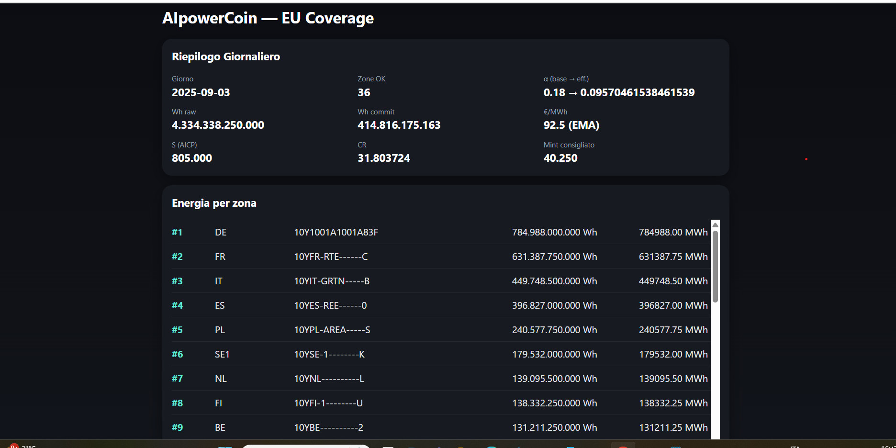

[README.md](https://github.com/user-attachments/files/22173047/README.md)
# AIpowerCoin

AIpowerCoin is a next-generation cryptocurrency that transforms real electric energy and computing power into stable, transparent, and secure digital value.

---

*Example dashboard: EU Coverage summary, energy zones, aggregated data, and key parameters.*

---

## Key Features

- **Stability anchored to energy:** Value comes from real European energy data, updated daily.
- **Transparency:** Every operation is attested and publicly verifiable.
- **Sustainability:** Only a prudent quota of energy is converted, preserving reserves.
- **Secure governance:** Attestations are digitally signed by multiple independent roles.
- **Auditability:** Anyone can check the data and verify signatures.

---

## How it works

1. Each day, the system collects real energy consumption data (ENTSO-E).
2. A fraction of this energy (commit ratio) is "covered" and converted into digital value.
3. A planner calculates the stability and suggests how much new value can be issued.
4. Everything is signed and published in a daily attestation file.
5. The dashboard displays the system status in a clear way.

---

## Technical Documentation

- [Technical Memo (EN)](docs/aicp_tech_memo_en.md)
- [Whitepaper v0.1 (EN)](docs/aicp_whitepaper_v01_en.md)
- [Technical Whitepaper v0.2 (EN)](docs/aicp_whitepaper_tech_v02_en.md)

---

## License

This project is released under the MIT License.

---

## Contacts & Collaboration

For questions, suggestions or collaborations:  
Open an issue on GitHub or contact us by email.
